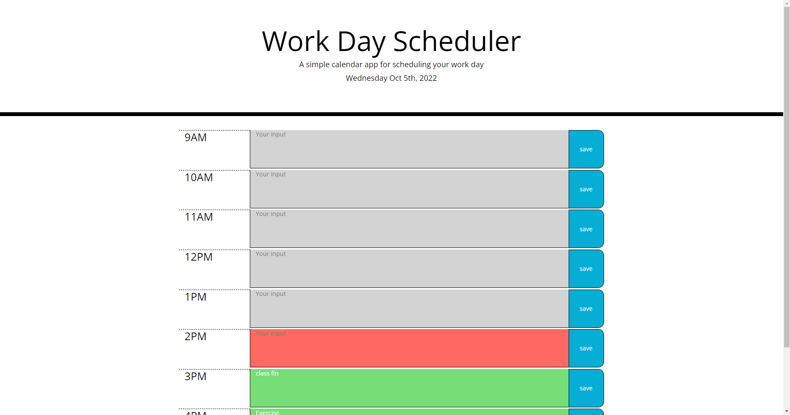

# work-day-scheduler

## Description 

We used JQuery for the javascript
 
I added some CSS styling for the linespaceing and other simple things

With JQuery we can handdle the flex box concept more effecient by determining with the container, row , and column

There are Month and date on the top and the background of the textbox 

also changes according to the time and there are some hover effects on the save button 

As I set the time to 24 hours system, it was easy to recognize the time because there is not overlapping time and also the time is going up by one 

## User Story 

```md
AS AN employee with a busy schedule
I WANT to add important events to a daily planner
SO THAT I can manage my time effectively
```

## Acceptance Crieria

```md
GIVEN I am using a daily planner to create a schedule
WHEN I open the planner
THEN the current day is displayed at the top of the calendar
WHEN I scroll down
THEN I am presented with timeblocks for standard business hours
WHEN I view the timeblocks for that day
THEN each timeblock is color coded to indicate whether it is in the past, present, or future
WHEN I click into a timeblock
THEN I can enter an event
WHEN I click the save button for that timeblock
THEN the text for that event is saved in local storage
WHEN I refresh the page
THEN the saved events persist
```

## Languages 

HTML, CSS, JavaScript

## Usage 

This is the workday scheduler that you can save the information to the local storage 

Also the background color of the text box changes according to the time period so it is easy to see the time with the color.

You should save the changes individually because the button is only liked to the same line textbox

Also, on the top there are day of the week, date, month, and year so it can helpful to handle the schedule

## App ScreenShot



## Live Website


## Contact 

Linkedin: https://www.linkedin.com/in/sangmi-yun-0a4241201/